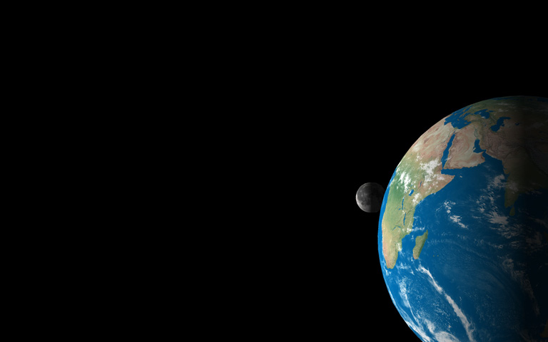

# Practical Assignment 6
**Dealine**: 21.11.2021

Please put your name here:  
**Name:** .......

## Problem 1
### Shearing Transform (Points 10 + 10)
Now the framework includes the **Tranform.h** file which contains the ```CTransform``` class. This class implements most of the affine transormations discussed at the lectures (when studying the class please pay extra attention to the rotation transoform). The main goal of this class is to deliver the transformation matrix with ```CTransform::get()```. Within this problem we will implement shear transform. Proceed as follows:
1. **Implement the shearing transform**
   * Fork the current repository
   * Modify the README.md file in your fork and put your name above
   * Study the ```CTransform``` class. It is written in respect to a design pattern, called [Fluent Interface](https://en.wikipedia.org/wiki/Fluent_interface)
   * Implement ```CTransform::shear()```method (_e.g._ in between ```translate``` and ```rotate```methods)
   * Achieve the resulting transformation matrix using the ```Mat CTransform::get()``` method

2. **Apply the shearing transform**
   * Study the new methods and member - variables in the ```CSolid``` class, namely the concept of the _pivot point_ and how it is used in the ```CSolid::transform(const Mat& t)``` method.
   * In order to apply transformation matrix to a solid use the ```CSolid::transform(const Mat& t)``` method. This method calls ```virtual void ÌPrim::transform(const Mat& t) = 0;``` wich should be implemented in all the derived classes.
   * Implement method ```void CPrimTriangle::transform(const Mat& t)``` in **PrimTriangle.h** file. Here you need to apply the transformation matrix to the vertices as well as to the normal of the triangle. You can use static methods ```static Vec3f CTransform::point(const Vec3f& p, const Mat& t)``` and ```static Vec3f CTransform::vector(const Vec3f& v, const Mat& t)```
   * Test your implementation on one of the solid spheres in the scene

## Problem 2
### Target Camera (Points 10 + 10)
So far we have used mostly the perspective cameras, which were defined as cameras' position, direction and field of view (fov). A camera defined like that is also called _free camera_. For many cases (_e.g._ for animation) it is more convinient to operate a _target camera_ instead. A target camera instead of the _direction_ vector has a _target_ point, _i.e._ the point of space where the camera looks at; thus it is defined with two points - position and direction (and same fov). The goal of the first problem is to prepare our camera for animation. Proceed as follows:
1. **Prepare the ```CCameraPerspective``` class for animation**
    * In ```CCameraPerspective``` class implement the following accessors: 
        * ```virtual void setPosition(const Vec3f& pos);```
        * ```Vec3f getPosition(void) const;```
        * ```virtual void setDirection(const Vec3f& dir);```
        * ```Vec3f getDirection(void) const;```
        * ```virtual void setAngle(float angle);```
        * ```float getAngle(void) const;```
   
   These methods will allow us to modify the camera after it was created and added to the scene.
2. **Implement the ```CCameraTarget``` class**
    * In the **CameraTarget.h** file implement the ```CCameraTarget``` class. It should be derived from the ```CCameraPerspective``` class and tt's constructor should have the following form: ```CCameraTarget(Size resolution, const Vec3f& pos, const Vec3f& target, const Vec3f& up, float angle)```, _i.e._ take parameter _target_ instead of parameter _pos_. Implement the above mentioned logic of target amera directly in initialization in constructor.
    * In ```CCameraTarget``` class implement the following accessors: 
        * ```virtual void setPosition(const Vec3f& pos) override;```
        * ```virtual void setTarget(const Vec3f& target);```
        * ```Vec3f getTarget(void) const;```
        
In **main.cpp** file substitute your free perspective camera with the target camera and test your implementation.

## Problem 3
### Geometry Animation (Points 30)
For this task we will animate some plantes of our Solar system. In particular we are interested in animation the motion of Earth and Moon around the Sun. The scene in **main.cpp** contains already the Sun at location (0, 0, 0), Earth at point (150'000, 0, 0) and Moon at point (150'000, 0, -384). Thus the plane y = 0 corresponds to the [ecliptic](https://en.wikipedia.org/wiki/Ecliptic) and unit 1 corresponds roughly to 1000 km.

For the animation we chose the time period of 24 hours. Our goal is to animate 1) rotation of the Earth around its axis, 2) rotaton of the Earth around the Sun and 3) rotation of the Moon around the Earth. We can use the following facts:
* Earth makes full cirlce arounts its axis for 24 hours
* Earth makes full circle around the Sun for 365 days
* Moon makes full cirlce around the Earth for 655 hours
* Moon does not rotate around its own axis
All rotations are counter-clockwise rotations when observed from the "Polar Star" (_i.e._ when observed from a point (0, 1000, 0))

To solve this problem proceed as follows:
1. Our scene contains already the Sun, the Earth and the Moon. Howeverm before we start animation, we need to tilt the Earth by 23.5° to the ecliptic plane, and rotate the Moon by 90° to face the Earth with its usual side. Use ```transform```object to derive the transformation matrices for these two rotations and apply the first to the Earth and the second to the Moon by using _e.g._ ```moon.transform();``` method. If everything is done correctly, your result should look like below:

2. Chose the amount of frames you will render and change the parameter ```const size_t nFrames``` accordingly. Let it be 180 frames, so the resulting video will be 6 seconds long. Thus, 180 frames will correspond to 24 hours. Calculate 1) the amount of degrees the Earth rotates around its axis for 1 frame; 2) the amount of degrees the Earth rotates around the Sun for 1 frame and 3) the amount of degrees the Moon rotates around the Earth for 1 frame. 
3. Assuming that the Sun is static and using ```transform```object and pivot points derive the transformation matrices to rotate the Eart around the Sun and its own axis and to rotate the Moon around the Earth.
4. Apply the derived matrices to the Earth and Moon after rendering every frame in the loop.
5. Test your implementation and submit the rendered video in "renders" folder

**Note 1:** Since we animate geometry, we need to rebuild the acceleration structure for every new frame.

**Note 2:** If rendering is too slow on your machine, you can reduce the resolution to 240p and / or reduce the amount of primitives by reducing value of the ```nSides``` parameter.

**Note 3:** For debugging you can easily switch betweein cameras using the method ```scene.setActiveCamera();``` in **main.cpp**

## Problem 4
### Camera Animation (Points 30)
Finally, we will animate the camera. Proceed as follows:
1. Add a target camera as ```cam3```to the scene. Initialize its target point to lie in the center of the Moon (150'000, 0, -384) and the origin to be the same as ```cam2```. 
2. Define the camera's target animation with 2 keypoints: 
    1. frame 0: target = (150'000, 0, -384);
    2. frame nFrames - 1: target = (149' 978, 0, -2'603) - location of the Earth at the last frame
3. Define the camera's origin animation with 3 keypoints:
    1. frame 0: origin = (149'989, 3, 250)
    2. frame nFrames / 2: origin = (149'500, -8, -1'300) 
    3. frmae nFrames - 1: origin = (149'400, 3, - 2'800)
4. Define the camera's opening angle animation with 3 keypoints:
    1. frame 0: angle = 3.5
    2. frame nFrames / 2: angle = 60 
    3. frmae nFrames - 1: angle = 30
5. Use linear splines for this kind of animation
6. (BONUS) Use hermite spline for points 3 and 4
6. Test your implementation and submit the rendered video in "renders" folder

## Submission
Please submit the assignment by making a pull request.
**Important** : Please make sure that
- No _extra files_ are submitted (except those, which were mentioned in the assignment)
- The changes were made _only_ in those files where you were asked to write your code
- The Continiouse Integration system (appVeyor) can build the submitted code
- The rendered images are also submitted in the folder "renders" 
